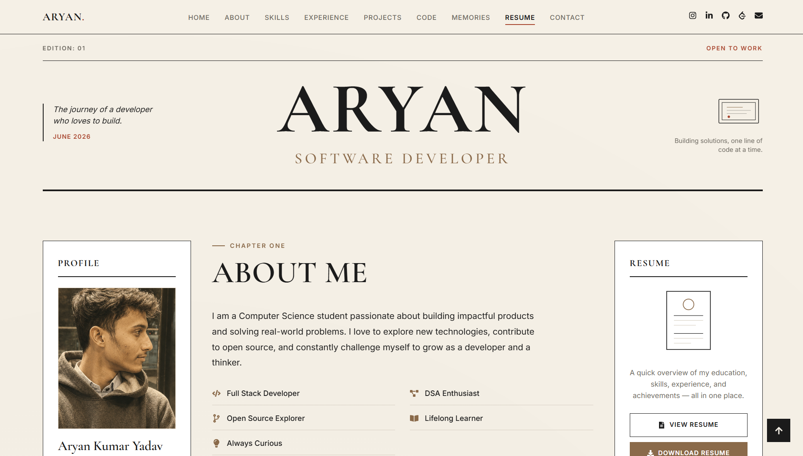

# 📰 Aryan's Portfolio

> **A newspaper-inspired developer portfolio crafted with React, Vite, and CSS.**
> Showcasing my journey as a software developer through an editorial magazine aesthetic.

<p align="center">
  
</p>

---

## ✨ About

This portfolio is designed to break away from traditional developer websites by adopting a **vintage editorial newspaper layout**, inspired by Niccolò Miranda's portfolio.

It showcases not only my technical skills but also my experiences, projects, coding journey, and memories in an engaging storytelling format.

---

## 🚀 Features

- 📰 Editorial/Newspaper inspired UI
- 📱 Fully Responsive Design
- 🎨 Vintage Magazine Theme
- 👤 Interactive Profile Section
- 📄 Resume Preview & Download
- 💼 Experience Timeline
- 🛠 Skills Showcase
- 🚀 Featured Projects
- 📊 GitHub Contribution Calendar
- 💻 LeetCode Statistics & Heatmap
- 📸 Memories Gallery
- 📬 Contact Form
- 🔗 Social Media Links
- 🌙 Smooth Animations & Hover Effects

---

## 🛠 Tech Stack

### Frontend

- React
- Vite
- JavaScript
- HTML5
- CSS3

### Libraries

- React Icons
- React GitHub Calendar
- EmailJS

### Design

- Figma
- Google Fonts
- Responsive CSS Grid
- Flexbox

---

## 📂 Folder Structure

```text
portfolio/
│
├── public/
│   ├── resume.pdf
│   ├── preview.png
│   └── favicon.ico
│
├── src/
│   ├── assets/
│   │   ├── images/
│   │   ├── icons/
│   │   └── memories/
│   │
│   ├── components/
│   │   ├── Header/
│   │   ├── Navbar/
│   │   ├── Profile/
│   │   ├── About/
│   │   ├── Resume/
│   │   ├── Experience/
│   │   ├── Skills/
│   │   ├── Projects/
│   │   ├── Github/
│   │   ├── Leetcode/
│   │   ├── Memories/
│   │   ├── Contact/
│   │   └── Footer/
│   │
│   ├── styles/
│   ├── App.jsx
│   └── main.jsx
│
├── package.json
└── vite.config.js
```

---

## 🎯 Sections

- Hero
- About Me
- Resume
- Skills
- Experience
- Projects
- GitHub Activity
- LeetCode Progress
- Memories Gallery
- Contact

---

## 🎨 Design Inspiration

The portfolio draws inspiration from:

- Vintage newspapers
- Editorial magazines
- Minimal typography
- Luxury print layouts

The objective was to create a portfolio that feels like reading a personal developer journal rather than browsing another template.

---

## 🚀 Getting Started

Clone the repository

```bash
git clone https://github.com/yourusername/portfolio.git
```

Go inside the folder

```bash
cd portfolio
```

Install dependencies

```bash
npm install
```

Run the development server

```bash
npm run dev
```

Build for production

```bash
npm run build
```
---

## 📬 Connect With Me

- 🌐 Portfolio: aryann-yadav-portfolio.netlify.app
- 💼 LinkedIn: https://linkedin.com/in/aryan-kumar-yadav/
- 💻 GitHub: https://github.com/Aryan-Kr-Yadav
- 📷 Instagram: https://instagram.com/wakeeuparyan
- 🧩 LeetCode: https://leetcode.com/u/Aryan_Kumar_Yadav/
- 📧 Email: aryanyadav30705@gmail.com.com

---

## ⭐ If you like this project

Give it a ⭐ on GitHub and feel free to fork it!

---

## 📜 License

This project is licensed under the MIT License.

---

<div align="center">

### "Sun will rise again tomorrow"

**— Rohit Sharma**

Made with ❤️ by Aryan

</div>
